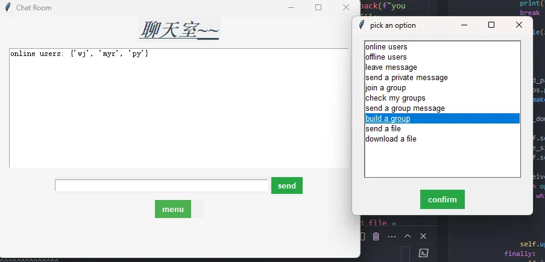

## Language

- [Language](#language)
  - [English](#english)
  - [中文](#中文)

---

### English

#### Project Introduction

https://roadmap.sh/projects/broadcast-server

This project is a Python-based chat application that includes both client and server sides. Users can log in, send messages, create and join groups, upload and download files, and perform other operations through a graphical user interface (GUI).

#### Features

- User login
- Online and offline user management
- Private messaging and offline messages
- Group creation, joining, and messaging
- File upload and download

#### File Structure

- `client.py`: Client code
- `server.py`: Server code
- `gui.py`: Graphical user interface code
- `files.py`: File operation code
- `README.md`: Project documentation
- `downloads`: File download directory
- `uploads`: File upload directory

#### Running

- `git clone https://github.com/SueBwj/Simple-Chat-Application-Using-Socket.git`
- Run `server.py` to start the server
- Run `gui.py` to start the client

---

### 中文

#### 项目介绍

https://roadmap.sh/projects/broadcast-server

这个项目是一个基于 Python 的聊天应用程序，包含客户端和服务器端。用户可以通过图形用户界面（GUI）进行登录、发送消息、创建和加入群组、上传和下载文件等操作。

#### 功能

- 用户登录
- 在线和离线用户管理
- 私人消息和离线留言
- 群组创建、加入和消息发送
- 文件上传和下载

#### 文件结构

- `client.py`: 客户端代码
- `server.py`: 服务器代码
- `gui.py`: 图形用户界面代码
- `files.py`：文件操作代码
- `README.md`: 项目说明
- `downloads`: 文件下载目录
- `uploads`: 文件上传目录

#### 运行

- `git clone https://github.com/SueBwj/Simple-Chat-Application-Using-Socket.git`
- 运行 `server.py` 启动服务器
- 运行 `gui.py` 启动客户端

